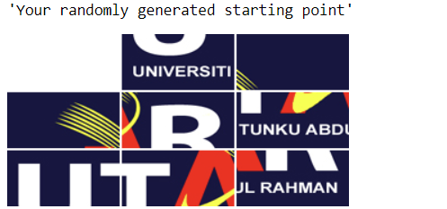
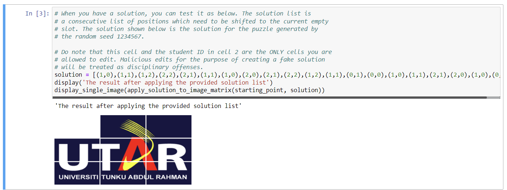
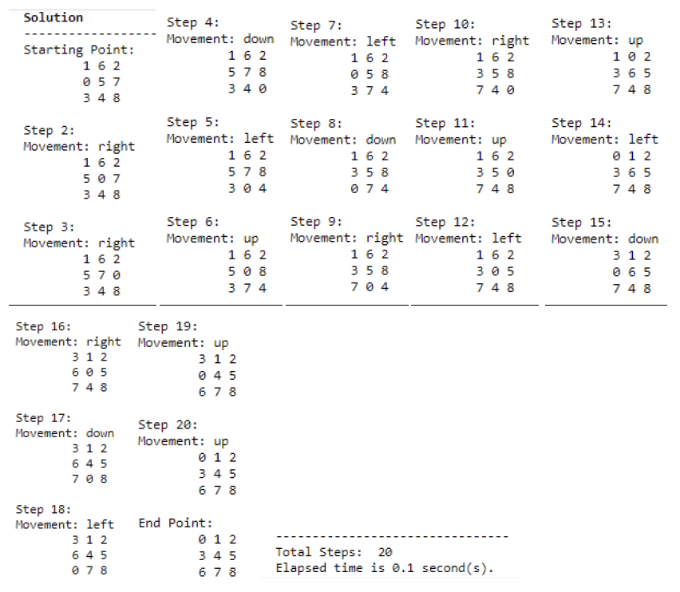

# BikeSharingDataMining
<!-- ALL-CONTRIBUTORS-BADGE:START - Do not remove or modify this section -->

<!-- ALL-CONTRIBUTORS-BADGE:END -->
<!-- ALL-CONTRIBUTORS-BADGE:START - Do not remove or modify this section -->

<!-- ALL-CONTRIBUTORS-BADGE:END -->

## Overview

This project aims to solve the 8 puzzle problem using A* search algorithm.

### Problem
The 8-puzzle problem is a puzzle invented and popularized by Noyes Palmer Chapman in the 1870s. It is played on a 3-by-3 grid with 8 square blocks labeled 1 through 8 and a blank square. The goal is to rearrange the blocks so that they are in order.

### Solution
A* (A-star) search algorithm is used to solve the 8-puzzle problem.
  
## Tools
1. Anaconda distribution package
2. Jupyter Notebook

## Usage
Import the files into your project. 
Run the project with Juypter Notebook.

## Previews
1. Start Point     
2. End Point     
3. Solution     
## Contributors ✨

Thanks goes to these wonderful people ([emoji key](https://allcontributors.org/docs/en/emoji-key)):

<!-- ALL-CONTRIBUTORS-LIST:START - Do not remove or modify this section -->
<!-- prettier-ignore-start -->
<!-- markdownlint-disable -->
<table>
  <tr>
    <td align="center"><a href="https://github.com/yuanjie8629"> <b>Tan Yuan Jie</b></a> <a href="https://github.com/yuanjie8629/EightPuzzleProblemSolving/commits?author=yuanjie8629" title="Code">💻</a> <a href="https://github.com/yuanjie8629/EightPuzzleProblemSolving/commits?author=yuanjie8629" title="Documentation">📖</a> <a href="#ideas-yuanjie8629" title="Ideas, Planning, & Feedback">🤔</a></td>
  </tr>
</table>

<!-- markdownlint-restore -->
<!-- prettier-ignore-end -->

<!-- ALL-CONTRIBUTORS-LIST:END -->

This project follows the [all-contributors](https://github.com/all-contributors/all-contributors) specification. Contributions of any kind welcome!